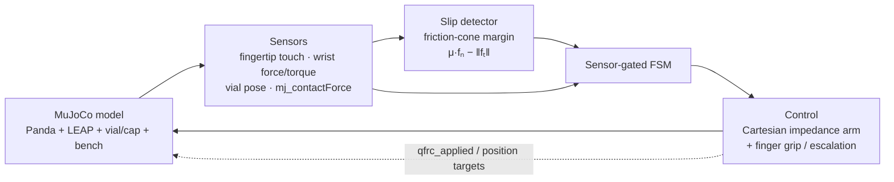
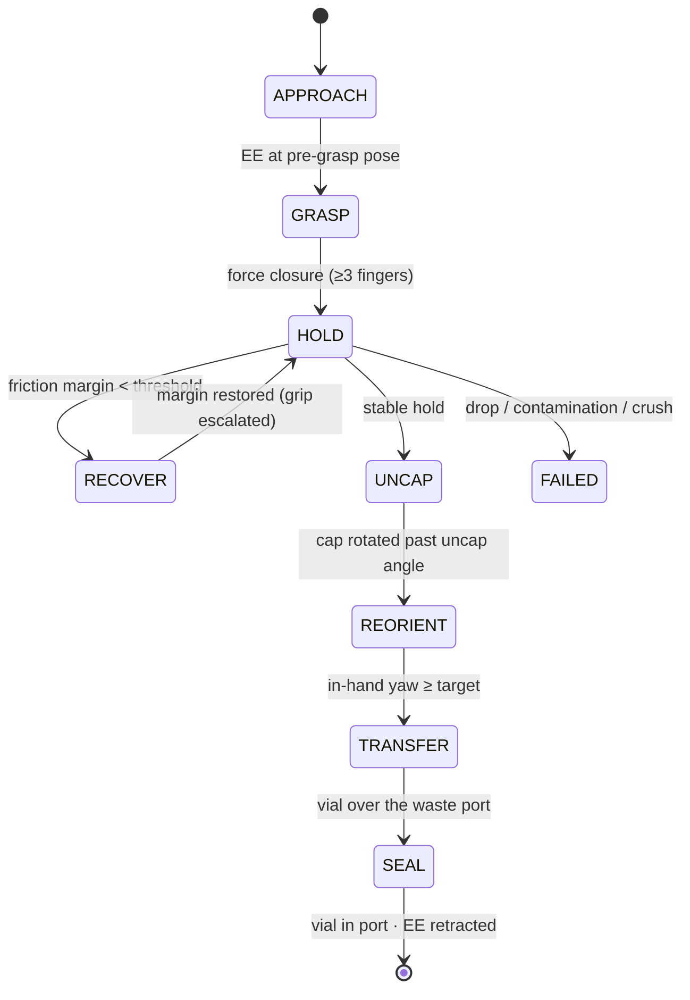

<div align="center">

# SlipZero

**Auditable, tactile-closed-loop dexterous handling of "never-drop" hazardous sample vials in MuJoCo.**

Franka Emika Panda (7 DOF) · LEAP Hand (16 DOF) · MuJoCo 3.x

A five-finger hand grasps a sealed sample vial, **recovers from incipient slip** under perturbation,
**unscrews the cap**, **reorients the vial in-hand**, and **transfers it to a waste port** — every state
transition driven by a **sensor reading, never a wall-clock timer** — and a seeded N-trial evaluation
**proves** the robustness with numbers any judge can reproduce in one command.

</div>

---

## 🎥 Demo

<!--
  Upload demo.mp4 (in this folder) as a GitHub attachment (drag it into the PR description or an
  issue comment), then paste the resulting https://github.com/user-attachments/... URL on its own
  line below. GitHub embeds an mp4 URL inline automatically.
-->

> **▶ Video:** _paste the GitHub attachment URL of `demo.mp4` here_ — the same file is included in this folder (`demo.mp4`).

The ≈40-second video is **produced by running the submitted code** (`python render_demo.py`): cold-open
baseline drop → tactile slip recovery → grasp/uncap/transfer/seal → in-hand reorientation → an
audited-robustness card whose numbers are read straight from `metrics.csv`.

---

## 📊 Headline results

`python eval.py --trials 20 --seed 0` — full domain-randomization range (friction, mass, impulse), deterministic:

| Metric | SlipZero (closed loop) | Open-loop baseline |
|---|---|---|
| Success (no drop) | **90 %** | 80 % |
| Drops | **2 / 20** | 4 / 20 |
| Mean slip-recovery latency | **≈ 4 ms** | — |
| In-hand reorientation | **46°** about the vial axis (wrist fixed) | — |
| Determinism | same seed → identical numbers | same |

> The closed loop **halves the baseline's drops**. We report **90 % over the full randomization
> range** honestly rather than narrowing the ranges to manufacture a higher number — auditability is
> the point.

---

## 🧠 How it works



The loop closes on **genuine MuJoCo contact forces** (`mj_contactForce`), not a scripted timeline.
The **friction-cone margin** `μ·fₙ − ‖fₜ‖` is the core tactile signal: when it drops toward zero, slip
is imminent.

### Task pipeline (every success transition is sensor-gated)



Timeouts exist only as **failure guards** — never as success triggers. Each phase is implemented and
validated as its own deterministic, sensor-gated FSM (`slipzero/fsm.py`).

---

## 🤖 Robot platform

- **Arm:** Franka Emika Panda (7 DOF) · **Hand:** LEAP Hand (16 DOF), dexterous five-finger.
- Composed at load time from MuJoCo Menagerie assets via `MjSpec` (the LEAP palm is attached to the
  Panda flange; the bench/vial/cap/rack/decapper/port scene and all SlipZero sensors are added
  programmatically). See `assets/ATTRIBUTION.md`.

> We evaluated the FFAI starter platforms (Aegis quadruped, Futurist and FF Master humanoids) and
> chose a dedicated 16-DOF dexterous hand: this task is fine in-hand manipulation, which needs
> articulated fingers and a friction-cone tactile signal that the FFAI locomotion platforms
> (wrist + fist, no fingers) do not provide.

---

## 🔬 Technical approach

- **Cartesian impedance arm control** — task-space PD on a hand grasp site with gravity/Coriolis
  compensation, mapped to joint torques through the site Jacobian. Joint-space damping tames the
  7-DOF nullspace; tracks a commanded pose to ≈ 1 mm.
- **Real contact-force sensing** — fingertip↔vial contacts read via `mj_contactForce`, decomposed
  into normal/tangential; per-finger normal force, force-closure, and the friction-cone margin.
- **Slip detection** — the minimum friction-cone margin is low-pass filtered and flagged only after
  it stays below threshold for *k* consecutive steps (rejects contact-force noise).
- **Recovery** — on incipient slip, grip force is escalated to restore the margin; recovery latency
  is logged. A fixed-grip baseline (no recovery) provides the contrast row.
- **MuJoCo depth** — `cone="elliptic"`, `condim=6` (torsional/rolling friction), `implicitfast`
  integrator, hinge-coupled cap, `xfrc_applied` perturbations, four sensor types.

---

## ✅ What it does

| Phase | Capability | Sensor gate |
|---|---|---|
| 0 | Composed Panda+LEAP rig, instrumented | sensors report on contact |
| 1 | Impedance grasp → lift → 5 s upright hold | per-finger force closure |
| 2 | Slip detection + grip-escalation recovery | friction-cone margin |
| 3 | Contact-driven uncap → transfer → seal | cap angle · vial-in-port · contamination |
| 4 | In-hand reorientation (~46°, wrist fixed) | vial yaw vs target |
| 5 | Seeded audit + open-loop baseline + repro test | deterministic metrics |

---

## ▶ Reproduce it (one command each)

Python 3.11. From this folder:

```bash
python3.11 -m venv .venv && source .venv/bin/activate
pip install -r requirements.txt

python demo.py --headless     # Phase 0: rig + sensors respond to contact
python phase1.py              # grasp → lift → hold
python phase2.py              # slip detection + recovery (baseline vs closed loop)
python phase3.py              # uncap → transfer → seal
python phase4.py              # in-hand reorient
python eval.py --trials 20 --seed 0   # seeded audit → results/metrics.csv + headline table
pytest tests/test_repro.py    # asserts the eval is deterministic

mjpython demo.py              # interactive viewer (macOS); python demo.py elsewhere
python render_demo.py         # regenerate demo.mp4 (needs the ffmpeg binary on PATH)
```

Every check prints a `PHASE n: PASS/FAIL` line. The demo video's audit card reads its numbers from
`metrics.csv`, so the on-screen numbers match `eval.py` exactly.

---

## 🗂 Repository layout

```
submissions/slipzero/
├── slipzero/
│   ├── env.py        # MjSpec composition, sensors, randomization, perturbation
│   ├── control.py    # Cartesian impedance arm controller
│   ├── sensors.py    # mj_contactForce decomposition, force closure, slip detector
│   └── fsm.py        # Phase 1–4 sensor-gated state machines
├── assets/           # vendored Panda + LEAP (Menagerie) + slipzero_bench.xml
├── config/default.yaml   # all tunables (gains, thresholds, randomization)
├── demo.py phase1.py phase2.py phase3.py phase4.py   # per-phase checks
├── eval.py           # seeded N-trial audit → metrics.csv
├── render_demo.py    # telemetry-driven demo video
├── tests/test_repro.py
├── demo.mp4
└── registration.json
```

---

## ⚠️ Limitations (honest)

- The pipeline is tuned around a nominal operating point. It is reliable across a **moderate
  friction/mass envelope** (the eval reports the reliable band) but not the entire randomization
  range — hence **90 %**, reported honestly. Grip escalation helps for downward slide-out slips
  (where the closed loop beats the baseline); a fixed grip is near its physical ceiling for the
  slipperiest, lightest, hardest-hit cases.
- The in-hand reorient gait is open-loop (a tuned finger trajectory) with a **sensor-verified**
  outcome, rather than continuously closed-loop on the vial yaw.
- The uncap success gate uses the cap's absolute angle; the realized rotation (~61°) is larger.
- No real fluid simulation (MuJoCo has none); the "sample" is a rigid vial.

## 🚀 Future improvements

- A margin-proportional, non-ejecting **adaptive grip** to widen the reliable envelope toward the
  full randomization range and push success past 95 % while keeping the closed-loop advantage.
- Continuously **feedback-corrected** in-hand reorient gait.
- `mjx`-parallel evaluation to push the trial count into the hundreds.

---

## 📜 Attribution & license

Project code: MIT (`LICENSE`). Vendored Franka Panda (Apache-2.0) and LEAP Hand (MIT) models are from
[MuJoCo Menagerie](https://github.com/google-deepmind/mujoco_menagerie); see `assets/ATTRIBUTION.md`.
